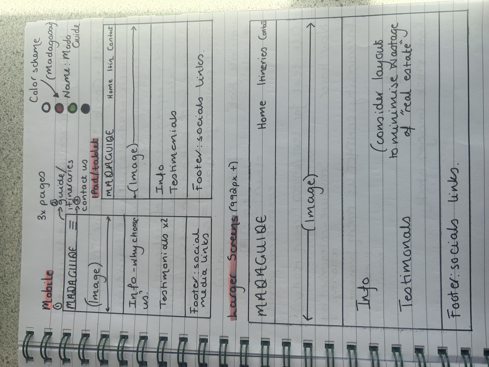
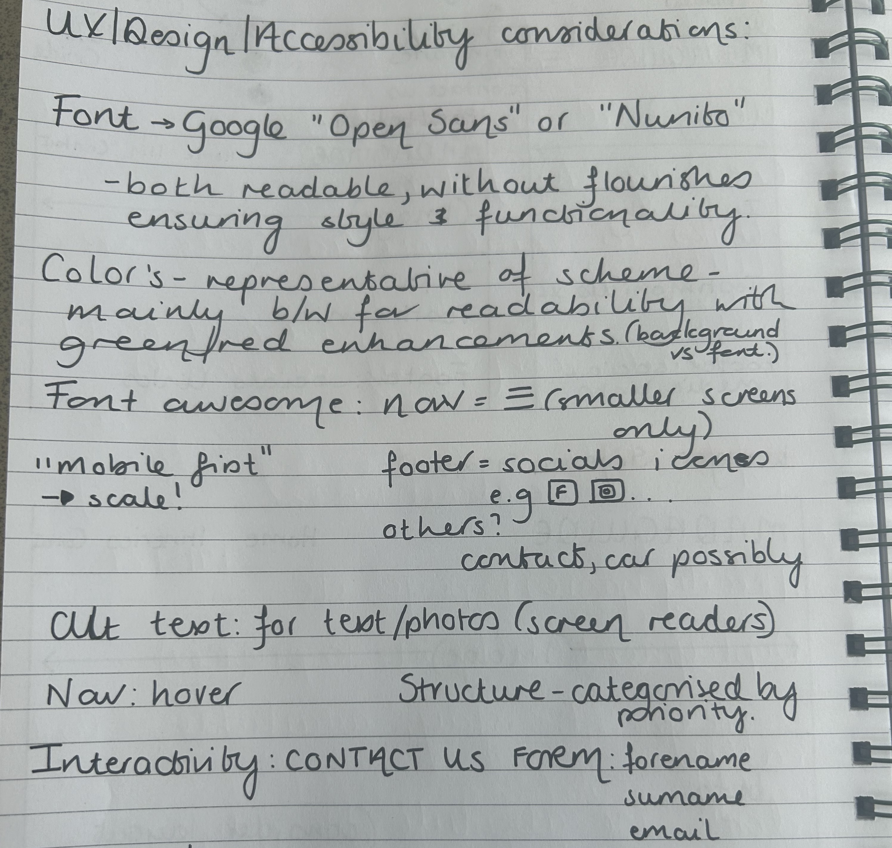
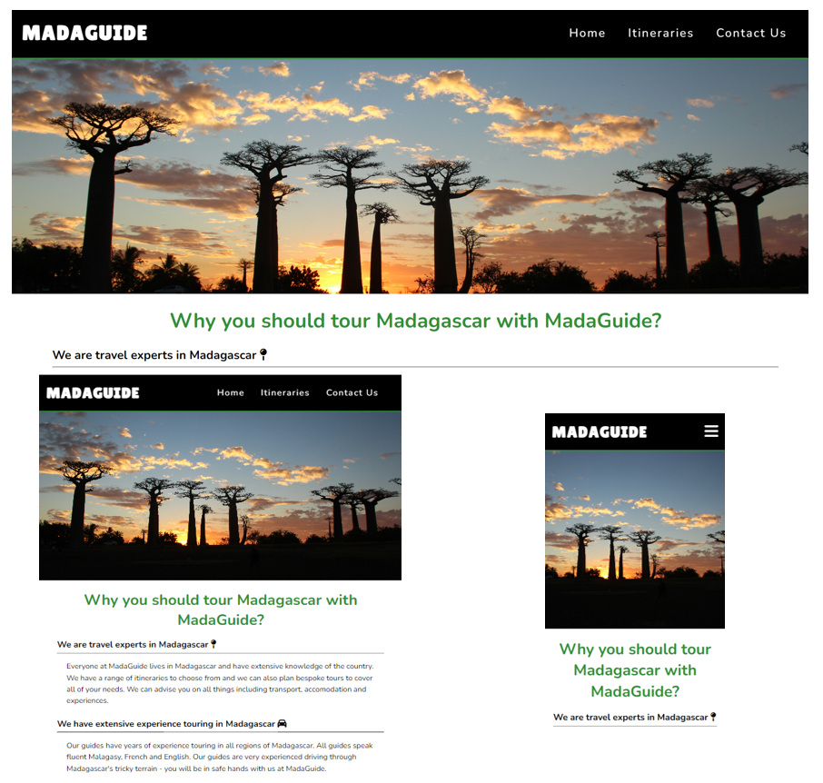
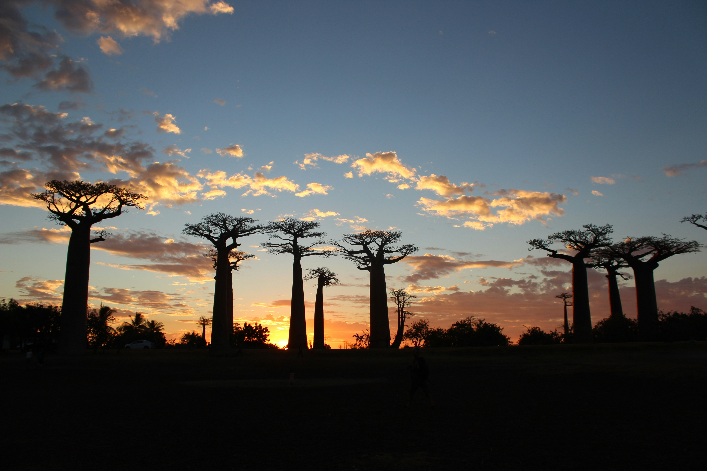

# MadaGuide

## Overview of project ##
MadaGuide is a website that encourages users to book a tour guide to explore Madagascar. The website is targeted towards tourists, both local people in Madagascar and international tourists with a variety of tour options and multi-lingual guides available. MadaGuide gives prospective customers a range of information including suggested itineraries and positive testimonials to encourage them to plan and book a fantastic trip with MadaGuide.

## Planning - UX and accessibility considerations ##

## UX ##

MadaGuide has been designed with simplicity in mind to maximise the experience for all users.
MadaGuide is designed using the "mobile first" principle to ensure mobile users have a great experience. Considerations and changes were made to suit larger screens to again provide a great experience, while maximising the space available. Google Developer tools were used at every stage to view the UX on mobile, tablet and larger laptop and desktop screens:

## Colour Scheme ##

The colour scheme for MadaGuide is mostly neutral to ensure readability and accessibility, with pops of colour used to reflect the flag colours of Madagascar. The red and green colours of the Madagascar flag can be overpowering and their use has therefore been limited to splashes of colour to draw attention to certain features such as a call to action (CTA).

Colours used:

- **#000000** - for primary texts and header/footer
- **#ffffff** - for logo and page background 
- **#309135** - for main headings and styling e.g. box shadow
- **#c92d18** - for a call to action e.g. submit button on contact us form 

## Typography ##

Two Google fonts were used for MadaGuide, both fonts are sans-serif without flourishes to provide style and functionality. Both fonts are widely regarded as accessible and look good.

Fonts used:

- **Lilita One** - for header logo
- **Nunito** - for all other text
- **Font Awesome** - a range of logos used to enhance headings, navigation and footer

## Features ##

### Navigation ###

The Navigation Bar is featured on all four pages. The full responsive navigation bar includes link to Home, Itineraries, Contact Us and Thank You pages and the navigation bar is identical on each page to ensure easy navigation. A menu (“hamburger”) button has been used for mobile screens to reduce the volume of information on this smaller pace and improve accessibility for all users.
This section allows users to easily navigate between pages and therefore enhances the UX of MadaGuide.

### Hero/landing image ###

The landing includes a stunning photograph of the Avenue of the Baobabs at sunset. This is regarded as Madagascar’s most iconic tourist attraction and has been used to capture the attention of users. It is immediately clear to users what they can expect to see if they plan a tour with MadaGuide.

### Reasons section ###

The reasons section allows the user to see the benefits of using MadaGuide to plan and book their tour of Madagascar. This section shows them why it is an amazing country to visit, why Madaguide are a great company to book with due to their local knowledge and years of experience. It also offers them testimonials from previous customers who highly praise MadaGuide. 

### Footer ###

footer functionality and design 

### Form ###

TBD

## Tools and Tech Used ##

## Testing ##

## Deployment ##

## Credits ##

## Acknowledgements ##  
