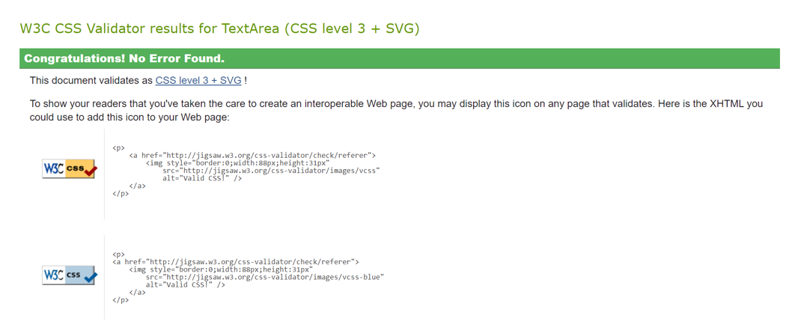

# MadaGuide

## Overview of project ##
MadaGuide is a website that encourages users to book a tour with a local guide to explore Madagascar. The website is targeted towards tourists, both local people in Madagascar and international tourists with a variety of tour options and multi-lingual guides available. MadaGuide gives prospective customers a range of information including suggested itineraries and positive testimonials to encourage them to plan and book a fantastic trip with MadaGuide. I recently travelled to Madagascar and found the process of booking the trip difficult due to the lack of reliable and up-to-date websites for tour operators and guides. When in Madagascar, locals agreed this was an area that required improvement to attract more international tourists. MadaGuide strives to improve this through the development of an easy to navigate website which contains the essential information that travellers require to confidently book a trip. 

## Planning - UX and UI ##
Prior to developing the website, I considered a variety of key features that would be integral to the success of MadaGuide. The majority of these initial ideas have been impleneted and some have evolved through the development process. 

### UX ###
MadaGuide has been designed with simplicity in mind to maximise the experience for all users.
MadaGuide has been developed using the "mobile first" principle to ensure mobile users have a great experience. Considerations and changes were made to maximise the use of space available by using media queries to suit larger screens again provide a great experience. Google Developer tools were used at every stage to view the UX on mobile, tablet and larger laptop and desktop screens:

### Colour Scheme ###

The colour scheme for MadaGuide is mostly neutral to ensure readability and accessibility, with pops of colour used to reflect the colours of the Madagascar flag. The red and green colours of the Madagascar flag can be overpowering and their use has therefore been limited to splashes of colour to draw attention to certain features such as a call to action (CTA). CSS variables were used to avoid repetition and enhance maintainability.

Colours used:

- **#000000** - for primary texts and header/footer
- **#ffffff** - for logo and page background 
- **#309135** - for main headings and styling e.g. box shadow (madagascar-green)
- **#c92d18** - for a call to action e.g. text decoration on the Navigation Bar, and the submit button on contact us form (madagascar-red)

### Typography ###

Two Google Fonts were used for MadaGuide, both fonts are sans-serif without flourishes to provide style and functionality. I researched which fonts were best for readability and both fonts are widely regarded as accessible and aesthetically pleasing. 

Fonts used:

- **Lilita One** - for header logo
- **Nunito** - for all other text
- **Font Awesome** - a range of logos used to enhance headings, navigation and footer

### User Stories ###
1.	As a first time or returning user, I want to be able to navigate the site with ease.
2.	As a prospective customer, I'd like to learn about MadaGuide and be able to view customer feedback so I have confidence booking a tour with them.
3.	As a prospective customer, I'd like to know the itineraries and options available – including what elements of the trip are included and excluded. 
4.	As a prospective customer, I want to be able to contact MadaGuide so we can begin planning one of the itineraries or a bespoke trip. 
5.	As MadaGuide, we want to introduce our tour guide company to users so they can learn more about us, our expertise and what we offer in Madagascar.
6.	As MadaGuide, we want to present users with the essential information they need to inspire them to use us to book their tour. 
7.	As MadaGuide, we want to compile a range of options for users to save them having to research and book everything separately, and at greater cost. 
8.	As MadaGuide we want to provide prospective customers with a form to get in touch with us and begin planning. 
9.	As MadaGuide, we want to provide social media links for prospective customers to view our social media content and connect with us. This may also encourage them to share photos and reviews following their tours.

## Features ##

### Navigation ###

The Navigation Bar is featured on all four pages. The fully responsive navigation bar includes links to Home, Itineraries and Contact Us pages. The Thank You page is not on the navigation bar and is only seen when users submit the Contact Us Form. The navigation bar is identical on each page to ensure easy navigation. A menu (“hamburger”) button has been used for mobile screens to reduce the volume of information on this smaller space and improve accessibility for all users. I added touches of colour to the Navigation Bar (through adding pseudo-class :hover, and a box-shadow) to increase accessibility and include recognisable Madagascan flag colours. This section allows users to easily navigate between pages and therefore enhances the UX of MadaGuide.

### Hero/landing image ###

The landing includes a stunning photograph of the Avenue of the Baobabs at sunset. This is regarded as Madagascar’s most iconic tourist attraction and has been used to capture the attention of users and potential customers. It is immediately clear to users what they can expect to see if they plan a tour with MadaGuide. I tested using an image tag with the CSS attribute object-fit: contain, to display the entire image across all devices, however I needed to limit the height to ensure the heading was above the fold.  

### Reasons section ###

The reasons section allows the user to see the benefits of using MadaGuide to plan and book their tour of Madagascar. This section shows them why it is an amazing country to visit, why MadaGuide are a great company to book with due to their local knowledge and years of experience. It also offers them testimonials from previous customers who highly praise MadaGuide. 
Icons have been used on each heading to improve the aesthetic of this text section, alongside a background image of a lemur to encourage users to read this section. Lemurs are endemic to the island of Madagascar and this image was chosen as lemurs will most likely feature on any planned trip by MadaGuide. The image is designed responsively to maximise space on each screen size. 

### Footer ###

The footer gives the user links to relevant social media sites to connect with MadaGuide and view their social media content. The links have recognisable social media icons for Facebook, Instagram and X that open to a new tab to allow for easy navigation. 
Like the header and navigation section, the footer is identical on each page to ensure uniformity and allow the user to access these links across any page.

### Itineraries ###

The itineraries provide the user with a range of options they can book with MadaGuide. The user can see exactly what experiences the itineraries offer, and what is included or not included when booking a tour. I created three different itineraries to show the range of experiences users can enjoy when planning a trip with MadaGuide. These tours can be booked as they are presented in the itineraries, or users can take inspiration from them and book a bespoke trip with MadaGuide too. This is detailed at the top of the itineraries section to encourage bookings and show the flexibility of booking with MadaGuide. 
An image of a 4WD has also been included to allow users to understand the type of vehicle that is used for each of these trips and get a sense of the adventure that awaits. 

### Contact Us Form ###

The Contact Us page allows the user to get in touch with MadaGuide to plan their trip to Madagascar. The form requires users to submit their first name, last name and email address. All fields are required, and once submitted users are directed to the Thank You page which ensures they know the form has successfully been submitted, and MadaGuide will be in touch soon. 
The form submit button uses the bright red colour (Madagascar-red) to show this is a CTA and both the form and submit button are responsive across devices. 

## Testing ##
Testing was used throughout the entirety of the MadaGuide project. Every HTML and CSS change or experiment was checked in the browser to monitor UX and the aesthetics of each page. With each change, Google Developer tools were used to test changes across mobile, tablet and larger laptop and desktop screens (see UX section).

### Validator Testing ### 
- **HTML**
    - W3C Validator returned an error message for the Itineraries list on the itineraries.html page. This was amended to remove obsolete code and returned no errors when retested. No other errors were returned when passing through the W3C validator. 

- **CSS**
    - No errors were returned when passing through the Jigsaw validator. 

### Browser Testing ### 
- MadaGuide has been tested and works successfully across various browsers including Google Chrome, Microsoft Edge and Safari.

### General Fixes ###
- During the process of developing MadaGuide, some bugs were encountered and addressed. My hero image was initially incorrectly positioned and fixed in this commit.
[Commit hero fix](https://github.com/LauraO90/MadaGuide/commit/65be237a450e20e19c00ace28f35866a8624a7ec)
- My initial implementation of the logo lacked appropriate spacing and fixed in this commit. [Commit logo fix](
https://github.com/LauraO90/MadaGuide/commit/39d22b854b03ba6703db65fb9273e015f982a932)

### Lighthouse Audit ###
- I ran Lighthouse on my project and the results were 100% for Accessibility, Best Practices and SEO, however, Performance was variable across mobile and desktop devices. I have observed scores above and below 90.
- As a result, I changed my hero and background image formats and sizes to improve Performance. I noted that Font Awesome was not served by a CDN and is accountable for the lower performance score and in future I would consider paying the Font Awesome fee to make use of their delivery network.

## Deployment ##

MadaGuide was created using Gitpod and the site was deployed to Github pages: [MadaGuide deployment](https://laurao90.github.io/MadaGuide/)

## Credits ##
### Tools and Tech Used ###
[GitPod](https://www.gitpod.io/) used for coding and developing MadaGuide. 

[GitHub](https://github.com) used for online code storage and deployment.

[CSS :root variables](https://www.w3schools.com/css/css3_variables.asp) used for frequently used styling e.g. colour scheme.

[Google Fonts](https://fonts.google.com/) used for more appealing font options.

[Font Awesome](https://fontawesome.com/) used for a variety of icons including for navigation (on mobile devices), social media icons for footer and for reasons section headings.

[Unsplash](https://unsplash.com/) used for stock images of Madagascar.  

## Acknowledgements ##  
I would like to thank my Code Institute mentor Chris Quinn for their support and guidance during this project. 